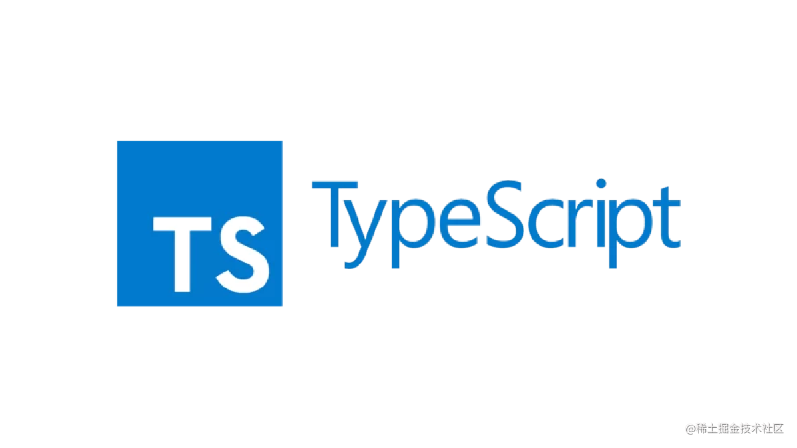

<h1 align="center">
  
   
</h1>

<h3 align="center">توضیحات برای تنظیمات در فایل tsconfig.json</h3>

### Target
تایپ اسکریپت به کدام نسخه جاوااسکریپت تبدیل بشه.
### RootDir
تایپ اسکریپت ها رو از کدام دایرکتوری بخونه.
### SourceMap
هنگام تولید فایل جاوااسکریپت ، نسخه مپ هم برای تولید شود.

این فایل نقشه حاوی اطلاعاتی است که به ابزارهای توسعه و اشکال‌زدایی کمک می‌کند تا بتوانند کد جاوااسکریپت فشرده‌شده و مینیفای شده را بازسازی و خوانایی راحت‌تری در اشکال‌زدایی ارائه دهند.
به طور کلی، فایل نقشه (.map) برای اشکال‌زدایی، توسعه و پیدا کردن خطاها در کدهای جاوااسکریپت فشرده و مینیفای شده بسیار مفید است.

